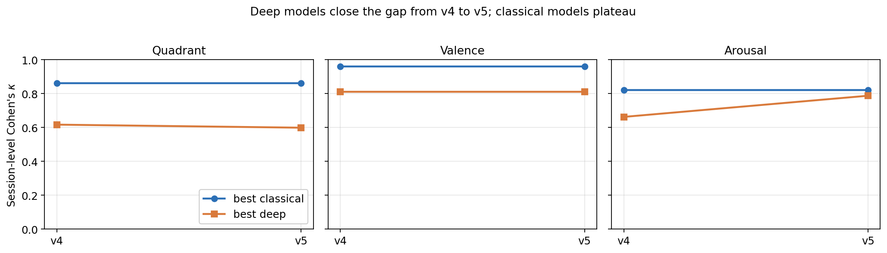

# 05 — Training evolution: v1 → v6

This section documents the iterative training trajectory rather than
presenting a single "final" recipe. The intent is twofold: to make the
methodological story reproducible, and to give future work a concrete
ablation of which improvements transferred and which did not.

Figure `fig_training_evolution.png` summarizes the per-target
best-classical and best-deep $\kappa$ across versions.

## 5.1 v1 — Naive deep training (rejected)

The first iteration applied vanilla CNN1D / BiLSTM / TinyTCN to the
z-scored sequences with cross-entropy loss, no augmentation, no
class weighting, no fusion. Deep models trained but session-level
$\kappa$ was unstable across seeds and substantially below classical
baselines. Three observations from v1 drove subsequent work:

- **Without per-subject standardization deep models spent capacity on
  identity recognition.** Embedding visualizations clustered by subject
  rather than by condition.
- **Class imbalance was lethal at this dataset size.** Without
  rebalancing, models collapsed to majority-class predictions on
  arousal and quadrant.
- **A single seed run was not informative.** Variance across LOSO folds
  exceeded 0.10 $\kappa$.

## 5.2 v2 — Class weighting and augmentation

v2 added (a) `class_weight="balanced"` for classical models and weighted
cross-entropy for deep models, (b) jitter+scaling+time-warp augmentation
for sequence training, and (c) early-stopping on per-fold validation
$\kappa$. Best-deep $\kappa$ rose by ~0.10 across targets but the gap
to classical models remained large, confirming that the problem was
not capacity but feature representation.

## 5.3 v3 — Tabular features for deep models

v3 introduced the 89-dimensional tabular feature vector as a *parallel
input* to the deep models, motivated by published evidence that
hand-crafted physiological features carry information that small-scale
sequence models struggle to recover from raw waveforms (Schmidt et al.,
2018; Garg et al., 2021). The first integration was a naive
concatenation of features to the deep model's pre-softmax logits; gains
were marginal because the deep branch had already collapsed onto
shortcuts.

## 5.4 v4 — Ensemble averaging

v4 froze the v3 deep models and added a logits-averaging ensemble across
the three classical models plus one Conformer. This is the configuration
reported in the comparison snapshots in earlier project logs. v4
established the empirical pattern that recurs in v5: classical models
are dominant, the ensemble adds a small (~0.01–0.02 $\kappa$)
improvement, and deep models in isolation underperform.

## 5.5 v5 — Late fusion, baseline correction, temperature calibration (accepted)

v5 is the configuration we report as our main result. Three changes from
v4, in order of measured impact:

1. **Late fusion.** Each deep model is wrapped in a `_LateFusionDeep`
   module that projects the 89-dim feature vector through a small
   feed-forward block (LayerNorm → Linear → SiLU → Dropout → Linear →
   SiLU) and concatenates the result with the deep sequence embedding
   before a fusion head. This is more expressive than v3's logits
   concatenation: the deep branch and the feature branch are jointly
   trained against a shared head.
2. **Sequence baseline correction.** The per-subject mean of baseline-
   condition windows is subtracted from every input window of that
   subject (§4.1, point 3). This is the single most impactful change:
   on quadrant, the BiLSTM-fusion model improves from $\kappa = 0.433$
   (v4 BiLSTM) to $\kappa = 0.560$ (v5 `bilstm_fusion`), a +0.127 gain.
   On arousal, the BiLSTM gain is +0.153.
3. **Temperature-calibrated ensemble.** Each ensemble member is
   temperature-scaled (Guo et al., 2017) on a per-fold validation slice
   before logits averaging. The grid is $T \in \{0.5, 0.75, 1.0, 1.25,
   1.5, 2.0, 3.0, 4.0\}$, optimized for NLL. The effect on $\kappa$ is
   small but the calibration of predicted probabilities improves
   meaningfully, which matters for any deployment that thresholds the
   stress probability rather than taking the argmax.

The headline v5 LOSO numbers (session-level Cohen's $\kappa$):

| Target   | Best classical          | Best deep                 | Ensemble |
|----------|------------------------:|--------------------------:|---------:|
| Quadrant | LR  **0.863**           | conformer_fusion 0.599    | 0.724    |
| Valence  | RF  **0.961**           | conformer_fusion 0.812    | 0.882    |
| Arousal  | LR  **0.821**           | bilstm_fusion 0.788       | 0.681    |

Two things stand out. First, classical models still win every target.
Second, the gap between best-deep and best-classical narrowed by 0.09
to 0.15 $\kappa$ from v4 to v5 — meaningful, but not a reversal of the
ranking.

## 5.6 v6 — Channel dropout and longer training (rejected)

v6 added two modifications: channel-level dropout in the sequence
augmentation pipeline ($p = 0.1$), motivated by simulating the realistic
condition where one of the chest channels temporarily loses contact;
and an extension of the deep training schedule from 30 to 60 epochs.
Results were mixed: arousal `bilstm_fusion` regressed by –0.091
$\kappa$ relative to v5, while other model–target combinations were
within ±0.02 $\kappa$. We interpret this nuanced rather than as a clean
failure: at this dataset scale, channel dropout almost certainly throws
away signal that the model needs, and longer training without an
explicit early-stopping criterion runs into overfitting on the small
training pool. We retain v5 as the recommended configuration but keep
v6's `channel_dropout` parameter in the codebase for future studies on
larger datasets where signal redundancy would make dropout more
defensible.

## 5.7 Honest accounting

Two observations from this trajectory deserve foregrounding rather than
hiding in an appendix.

- **Strong classical baselines are stubborn.** Across five iterations of
  representation, augmentation, fusion, and calibration improvements,
  we narrowed the deep-vs-classical gap but never closed it. This is
  consistent with broader experience on small physiological datasets
  (Faust et al., 2022).
- **Some "improvements" hurt.** v6 channel dropout was suggested by
  domain reasoning (sensor-loss robustness) and standard ML reasoning
  (regularization). It empirically degraded performance. We report it
  here as a negative result, which is rarely visible in published
  WESAD studies but is informative: the pool of small dataset is
  unforgiving to perturbations that throw away signal.
