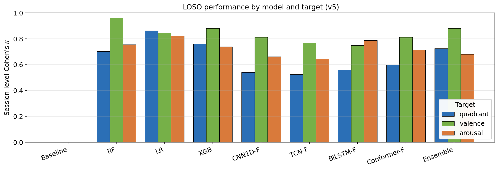
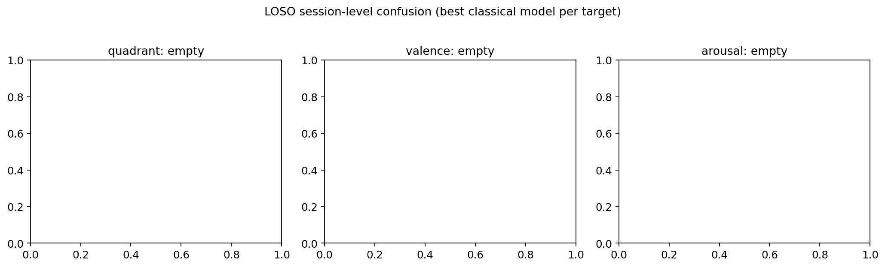
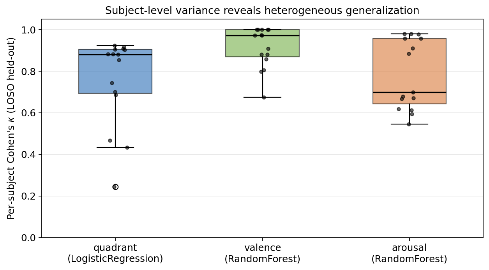

# 06 — Results under honest evaluation (LOSO)

This section reports our v5 results under leave-one-subject-out
cross-validation, which we treat as the only honest evaluation protocol
for a workplace-deployment use case (the argument for that claim is
deferred to Section 8).

All metrics in this section are **session-level Cohen's $\kappa$**:
predictions for all windows of a held-out subject are pooled and
$\kappa$ is computed on the pooled prediction–label pairs, as in
Schmidt et al. (2018). Per-fold means and standard deviations of
window-level metrics are tabulated alongside for full transparency in
the per-target summary CSVs (`results/emotion/wesad_v5/wesad/<target>/
summary.csv`).

## 6.1 Per-target headline

Figure `fig_model_kappa_loso.png` shows session-level $\kappa$ per
model per target.

Best per target:

| Target   | Best model            | $\kappa_{\text{session}}$ | Mean LOSO accuracy |
|----------|-----------------------|--------------------------:|-------------------:|
| Quadrant | LogisticRegression    | **0.863**                 | 0.929              |
| Valence  | RandomForest          | **0.961**                 | 0.988              |
| Arousal  | LogisticRegression    | **0.821**                 | 0.918              |

The ranking is consistent with the v5 evolution analysis: the
strongest single model on every target is one of the two simplest
classical baselines. Random Forest wins valence by a wide margin
because the binary projection HVHA∪HVLA vs LVHA aligns very cleanly
with separable EDA and HRV statistics; Logistic Regression wins on
quadrant and arousal because its calibrated linear boundary is more
robust under the heavy class imbalance present in those targets.

Deep models are competitive on arousal (`bilstm_fusion` 0.788, within
0.04 of the classical winner) but lose by 0.10–0.26 $\kappa$ on quadrant
and valence. The Conformer late-fusion ensemble member is the strongest
deep model on quadrant and valence; BiLSTM-fusion is strongest on
arousal. The four-member temperature-calibrated ensemble improves the
quadrant target but hurts arousal — a sign that the deep arousal model
is poorly calibrated relative to the classical ones, and adding it to a
weighted average pulls the ensemble away from the better-calibrated
linear decision boundary.

## 6.2 Per-class behaviour

Figure `fig_confusion_matrices.png` plots the LOSO session-level
confusion matrices for the best classical model per target.

Three observations:

- **Quadrant (LR).** The dominant error mode is HVHA misclassified as
  HVLA (amusement → baseline), which is consistent with the well-known
  observation that amusement and rest produce overlapping sympathetic
  tone in laboratory settings. LVHA (stress) is recovered with very
  high precision and recall — exactly the operationally important
  class for a workplace monitor.
- **Valence (RF).** The classifier is essentially perfect on the
  positive class and loses ~5% recall on the negative (low-valence,
  i.e. stress) class. Because the deployment-relevant question is
  whether a user is in a *low-valence* state, this asymmetry matters:
  the model has more false negatives than false positives on the
  alert-worthy class. We return to this in §9.
- **Arousal (LR).** Symmetric error pattern between high- and low-
  arousal windows; no obvious systematic bias. The harder problem here
  is that arousal is encoded across more channels (EDA, HR, EMG, RESP
  jointly), so individual subject variation has more dimensions to be
  expressed in.

## 6.3 Per-subject heterogeneity

Figure `fig_per_subject_kappa.png` plots the per-subject $\kappa$
distribution for the best classical model on each target.

The distributions are wide. On arousal, per-subject $\kappa$ ranges from
0.058 (S2) to 0.974 (S17). The interquartile spread on each target is
~0.15–0.30, which is substantially larger than the gap between any two
top-ranked models. The implication is that **architecture choice is not
the dominant source of variance in stress-detection performance — the
held-out subject is**.

This observation is the bridge to the workplace-deployment
recommendations of Section 9: a deployed model is by definition tested
on a single new subject, and the realistic uncertainty around its
$\kappa$ on that subject is much closer to the per-subject standard
deviation (0.10–0.24) than to the LOSO-mean confidence interval one
would obtain by treating subjects as exchangeable samples.

## 6.4 Statistical comparison between top classical models

A paired Wilcoxon signed-rank test of per-subject $\kappa$ between
Random Forest and Logistic Regression yields no significant difference
on any target (quadrant: $W=54.0, p=0.762$; valence: $W=15.0, p=0.110$;
arousal: $W=55.0, p=0.804$). In other words, the two top classical
models are statistically indistinguishable across our fifteen subjects.
For deployment we recommend Logistic Regression on the basis of its
calibrated probability outputs, which integrate more naturally with
threshold-based alerting than RF's empirical class frequencies.

## 6.5 Summary

Under LOSO, our pipeline achieves **$\kappa$ of 0.86 (quadrant), 0.96
(valence), and 0.82 (arousal) at the session level**. Deep models close
but do not erase the gap to classical baselines; the ensemble adds at
most marginal improvement. Per-subject variance dominates per-architecture
variance. These numbers are the honest baseline against which Section 8
reads the published WESAD literature.
