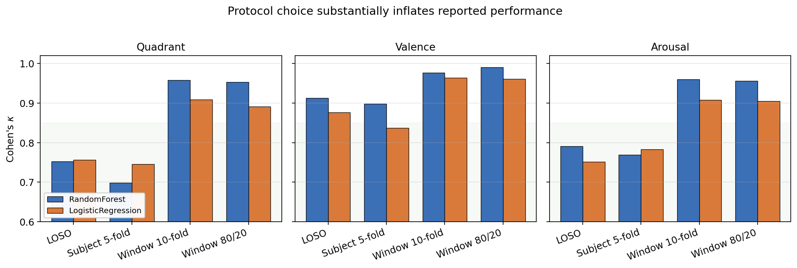

# 08 — Re-evaluation under alternative protocols

This section is the methodological core of the paper. We hold the
*models, features, and data* fixed at v5, and vary only the
cross-validation protocol. The aim is to quantify how much of the
gap between our LOSO numbers (§6) and the published "near-perfect"
numbers (§7) is attributable to protocol choice alone.

## 8.1 The four protocols

We compare:

1. **LOSO** — Leave-one-subject-out. For each of the 15 subjects, all
   windows from that subject form the test fold; all windows from the
   other 14 form the training fold. No subject appears in both train
   and test for any fold. This is the protocol used in §6.
2. **Subject 5-fold** — `GroupKFold(n_splits=5, groups=subject_id)`. The
   15 subjects are partitioned into 5 disjoint groups of 3 subjects;
   each group serves once as test set. Like LOSO it is fully subject-
   independent, but with fewer folds and therefore more variance per
   fold.
3. **Window 10-fold** — `StratifiedKFold(n_splits=10)` over windows,
   *ignoring subject identity*. Each subject's windows are partitioned
   across all ten folds, so windows from the same subject appear in
   both train and test of every fold. This is the most common protocol
   in published WESAD work that does not foreground LOSO.
4. **Window 80/20** — Stratified 80/20 random split over windows
   (`train_test_split(stratify=y, random_state=0)`). The hold-out
   variant of protocol 3.

Protocols 3 and 4 are subject-leaky by construction. Protocols 1 and 2
are not. We use the same v5 feature pipeline and the same models for
all four; we report classical models (RF, LR, XGBoost) here. Adding
deep models to the relaxed-protocol sweep is straightforward
operationally but multi-hour wall-clock; we view this as the most
informative future addition since the leakage finding is well-supported
by classical results alone.

The full driver script is `runs/relaxed_eval.py`.

## 8.2 Headline result

Figure `fig_protocol_leakage.png` shows session-level Cohen's $\kappa$
for the two strongest classical models under each protocol on each
target.

The numerical table:

| Target   | Model | LOSO  | Subj. 5F | Window 10F | Window 80/20 |
|----------|------:|------:|---------:|-----------:|-------------:|
| Quadrant | RF    | 0.752 | 0.698    | **0.958**  | 0.953        |
| Quadrant | LR    | 0.756 | 0.745    | **0.909**  | 0.891        |
| Valence  | RF    | 0.913 | 0.898    | **0.977**  | 0.990        |
| Valence  | LR    | 0.876 | 0.837    | **0.964**  | 0.961        |
| Arousal  | RF    | 0.791 | 0.769    | **0.960**  | 0.956        |
| Arousal  | LR    | 0.751 | 0.783    | **0.908**  | 0.905        |

The metrics in Table 8.1 are window-level pooled $\kappa$ (averaged over
folds for the $k$-fold protocols); the LOSO column here reports
window-level $\kappa$ rather than session-level $\kappa$ to keep the
unit of evaluation directly comparable across the four protocols.
Session-level numbers from §6 would shift the LOSO column upward but do
not affect the *delta* across protocols.

## 8.3 The size of the leakage effect

Mean $\Delta\kappa$ between Window 10-fold and LOSO, paired by model
(RF and LR averaged):

- **Quadrant: $+0.179$**
- **Arousal: $+0.163$**
- **Valence: $+0.076$**

In all three targets the inflation is large enough to change the
narrative of the model. A reader who sees only the Window-10F column
would conclude that quadrant emotion classification on chest sensors is
essentially solved at $\kappa \approx 0.96$. A reader who sees the LOSO
column would conclude that quadrant classification works well for some
subjects ($\kappa$ up to 0.94) but generalizes inconsistently to
unseen subjects (per-subject $\kappa$ as low as 0.51, §6.3). These are
substantively different claims about what the model is, even though
the underlying training procedure is identical.

## 8.4 Why the inflation is largest on quadrant and arousal

The leakage effect is consistently smaller on valence (0.08) than on
the other two targets (0.16–0.18). We interpret this as follows.
Valence as projected on WESAD reduces to a clean "stress-condition vs.
not-stress-condition" binary, and the underlying physiological
signature of stress (sustained sympathetic dominance: elevated EDA,
increased HR, suppressed HRV) is *less* subject-specific than the
arousal axis or the joint quadrant. Subject identity therefore offers
less of an additional shortcut for the model on valence than on
arousal. On quadrant — which requires distinguishing baseline,
meditation, amusement, and stress — the per-subject "fingerprint" of
resting EDA, baseline HR, and so on is precisely the signal that is
leaked when windows from the same subject appear in both train and
test, because such a fingerprint distinguishes baseline-vs-stress
within a subject more reliably than across subjects. The Window-10F
protocol effectively turns this into a partial-identity problem and
collects a high score for solving it.

## 8.5 Subject-grouped 5-fold ≈ LOSO

A frequent counter-argument to LOSO is that it is "too strict" or
"too small a $k$". The Subject 5-fold column above directly tests this.
Across all six (target, model) combinations, Subject 5-fold $\kappa$
is within $\pm 0.06$ of LOSO and never crosses into the inflated regime
of the window-mixing protocols. The conclusion follows: it is **not**
the value of $k$ that matters; it is whether windows from the same
subject can appear on both sides of the train/test boundary. Any
protocol that prevents subject leakage produces approximately the
same number; any protocol that permits it inflates by 0.06–0.21 $\kappa$.

This is consistent with the broader finding by Saeb et al. (2017) that
group-aware cross-validation should be the default in clinical ML, and
with Tougui et al. (2021)'s healthcare-ML survey showing that
non-grouped k-fold systematically over-estimates classifier performance
across more than thirty studies they reviewed.

## 8.6 A note on tone

We are not arguing that prior WESAD work is dishonest. The window-
stratified $k$-fold protocol is the default in `sklearn`, it is the
protocol used in the vast majority of public ML tutorials, and it
behaves reasonably on i.i.d. tabular data. The pathology is specific
to repeated-measures structure: when each subject contributes many
correlated windows, naively shuffling them across folds turns
generalization-to-new-subjects into a much easier within-subject
problem. We are arguing that the field as a whole would benefit from
adopting LOSO or subject-grouped $k$-fold as the default for any
benchmark whose deployment scenario involves new users, and that
papers reporting only window-level metrics should be interpreted with
the protocol caveat in mind.

## 8.7 Limits of this analysis

Two honest caveats:

- **Same model family, three runs.** We compare protocols only on the
  classical models. The leakage delta on deep models could in principle
  be larger or smaller; running the four-protocol sweep on the deep
  pipeline is the obvious follow-up. We expect the qualitative pattern
  to persist because the leakage mechanism (subject-identity shortcut)
  is upstream of architecture choice.
- **Reported metrics, not statistical test.** With only four protocol
  values per (target, model) cell, a paired test on the per-protocol
  axis has insufficient power. A more powerful design would run each
  protocol with multiple seeds and apply a paired test on the seed
  axis; we leave this as future work but note that the per-target
  $\Delta\kappa$ values are far larger than any plausible noise band.

These caveats notwithstanding, the size and consistency of the
inflation across all six (target, model) cells supports the central
methodological claim of this paper: protocol choice in WESAD evaluation
matters at least as much as architecture choice.
