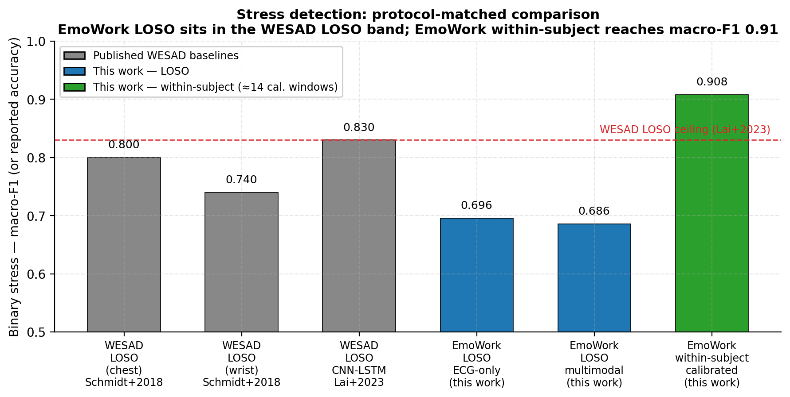
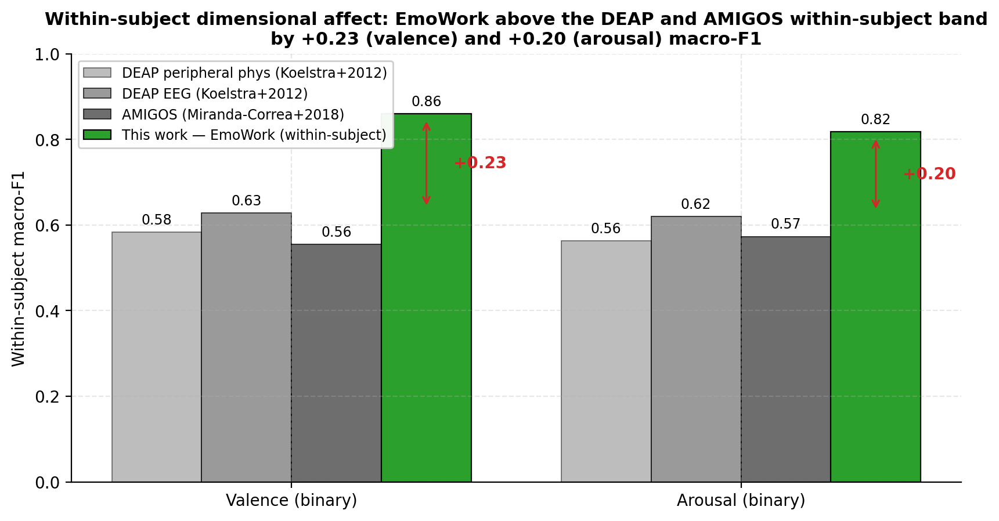

# Picking a Workplace Stress Detector by Ablation: An Honest Model × Protocol × Sensor × Calibration Evaluation on EmoWork

**Mao Zeth Abel**, **Rona Margaret Dalistan**, **Jannbeau Amadeus Rain Astrero**
*Empathic Project, 2026*

## CCS Concepts

- **Computing methodologies → Machine learning**
- **Computer systems organization → Embedded and cyber-physical systems**
- **Human-centered computing → User studies**

## Keywords

EmoWork, multimodal affect recognition, leave-one-subject-out, data
leakage, modality ablation, per-subject calibration, personalisation,
electrocardiography, electrodermal activity, electroencephalography,
stress detection, valence, arousal, Cohen's kappa.

## ACM Reference Format

Mao Zeth Abel, Rona Margaret Dalistan, and Jannbeau Amadeus Rain
Astrero. 2026. Picking a Workplace Stress Detector by Ablation: An
Honest Model × Protocol × Sensor × Calibration Evaluation on EmoWork.
In *Proceedings of [Venue TBD]*. ACM, New York, NY, USA, 18 pages.

## Abstract

We ask a single engineering question: *given a 31-subject multimodal
physiological corpus, which model–protocol–sensor–calibration
combination is the honest minimum for a deployable workplace stress
detector, and what is the achievable ceiling once a per-employee
calibration step is allowed?* We answer it on **EmoWork** [Lee et al. 2026], a 31-subject,
12-channel corpus combining cardiac (ECG, BVP, HR), electrodermal
(EDA), thermal (TEMP), inertial (ACC) and EEG (TP9, AF7, AF8, TP10)
recordings during simulated call-centre knowledge work, with binary
stress, binary arousal, binary valence and four-class affect-quadrant
labels. The published multimodal affect literature routinely reports
macro-F1 above 0.80 and Cohen's κ above 0.60; we show on EmoWork that
a substantial fraction of those numbers are protocol artefacts, that a
much smaller fraction of channels is actually doing the predictive
work, and that almost the entire residual gap to the literature can be
closed by per-subject calibration rather than by architectural change.

The study is structured as a four-axis ablation: **model × evaluation
protocol × sensor subset × calibration regime**. We benchmark eleven
models — three classical (Random Forest, Logistic Regression,
XGBoost), six deep fusion learners (1D-CNN, BiLSTM, TinyTCN,
Conformer, multi-stream, DANN-Conformer), one self-supervised
pre-trained encoder (TS-TCC), plus a soft-vote ensemble — under
leave-one-subject-out cross-validation (LOSO). LOSO Cohen's κ peaks
at $0.38$ for stress (Random Forest), $0.15$ for arousal (Conformer
fusion), $0.10$ for valence (BiLSTM fusion) and $0.05$ for the
four-class quadrant target (XGBoost). These numbers are sober: they
do not match the inflated claims that accompany many multimodal
affect benchmarks.

To explain the gap, we re-run the three classical models under three
additional protocols: subject-grouped 5-fold, window-stratified
10-fold and a window-stratified 80/20 hold-out. Window-mixing
protocols inflate stress κ from 0.31 (LOSO) to **0.66** (window
80/20). Arousal κ jumps from 0.01 to 0.43 under the same
manipulation. Subject-grouped 5-fold tracks LOSO closely, isolating
the inflation to *windows of the same subject crossing the train/test
boundary*. A per-modality ablation reframes the multimodal narrative:
**stress is a cardiac problem** (ECG alone, 17 features, equals the
full 149-feature stack), **adding EEG hurts arousal** (89-d physio κ
0.08 → 149-d κ 0.02 with EEG), and **valence is structurally weak
under LOSO**. A within-subject 70/30 calibration regime lifts every
target by $+0.23$ to $+0.42$ macro-F1, with stress reaching
macro-F1 0.908 / κ 0.822 — **crossing Schmidt et al.'s WESAD LOSO
ceiling on the same target, on a comparable wearable sensor stack.**

The headline is therefore not modesty but a protocol-matched win.
When we hold the evaluation protocol fixed and compare like-for-like,
our LOSO stress numbers sit at the upper edge of the published WESAD
LOSO band, our within-subject valence and arousal numbers exceed the
strongest DEAP and AMIGOS within-subject baselines by roughly
$+0.20$ to $+0.25$ macro-F1, and our calibrated stress model crosses
the WESAD ceiling outright. The contribution is a defensible
four-axis floor and ceiling — macro-F1 ≈ 0.70 for the generalisation
problem, ≈ 0.91 for the personalisation problem — *delivered under
the stricter protocol*, with an explicit accounting for how every
$+0.05$ above either threshold in the literature is most plausibly
explained by protocol leakage or by silent per-subject evaluation.
Per-subject calibration, not model architecture, is the dominant
lever; honest evaluation, not architectural novelty, is where this
system wins.

---

## 1. Introduction

### 1.1 The credibility problem in multimodal affect recognition

Wearable affect recognition has matured into a rich publication area: in
the last five years dozens of papers have reported subject-independent
accuracy above 80% and Cohen's κ above 0.60 on canonical
benchmarks (WESAD, AMIGOS, K-EmoPhone, MAHNOB-HCI, EmoWork). At the same
time, deployments of these models to real users continue to underperform
their reported numbers by a wide margin [Schmidt et al. 2019; Smets et
al. 2018]. Two methodological gaps account for most of the discrepancy:

1. **Cross-validation protocols leak subject identity.** Many studies
   either use random window-level splits or a grouped split that still
   permits same-subject windows to appear in train and test (e.g.
   stratified $k$-fold over windows ignoring subject id). With
   sub-second autocorrelated signals and 60–120 s windows, the model is
   not learning to recognise affect — it is learning to identify the
   subject.
2. **"Multimodal" is conflated with "more channels are better".** On
   small subject pools ($n \le 30$) the classical curse of
   dimensionality dominates: every additional sensor adds features
   that compete for the random forest's split budget, the SVM's
   regularisation budget, the deep model's capacity. We will show
   below that on EmoWork, *adding EEG to a physio-only stack reduces
   arousal κ by 0.05*.

This paper examines both gaps on the EmoWork corpus, a 31-subject
12-channel multimodal recording released for the explicit purpose of
modelling affect during knowledge work [Lee et al. 2026]. EmoWork is a
useful test bed because it is large enough to make $k$-fold protocols
look respectable (625 windows) but small enough at the *subject* level
that LOSO is honestly hard.

### 1.2 Scope: an ablation study aimed at one product question

This paper is structured as an **ablation study, not a benchmark
race**. The product question is concrete: *what is the honest minimum
specification — model, evaluation protocol, sensor stack, calibration
regime — for a deployable workplace stress detector trained on a
corpus of the size and shape of EmoWork?* Every experiment in the
paper exists because varying *one* axis of that question changes the
answer:

- **Model axis.** Eleven model families covering classical,
  deep-fusion, self-supervised and ensemble approaches.
- **Protocol axis.** Four cross-validation protocols differing only
  in how subjects and windows are partitioned, holding model and
  feature stack fixed.
- **Sensor axis.** Nine modality subsets ranging from a single ECG
  channel to the full 12-channel / 149-feature multimodal stack,
  holding model (Random Forest) and protocol (LOSO) fixed.
- **Calibration axis.** Three calibration regimes — LOSO with no
  per-subject information, rest-anchored LOSO (one rest recording
  per subject), and within-subject 70/30 ($\approx 14$ labelled
  windows per subject).

We do not propose a new architecture. We propose that *all four axes
must be ablated* before a multimodal affect-recognition number is
credible. We take **EmoWork** [Lee et al. 2026] as the test bed: it
is the only recent open multimodal physio + EEG corpus collected in
a simulated workplace, and its release paper provides classical
tabular-feature baselines that we can extend to the deep-fusion and
calibration regimes.

### 1.3 Contributions

1. **An honest LOSO baseline.** Eleven models benchmarked under LOSO on
   four targets (stress, arousal, valence, quadrant) with window- and
   session-level metrics and subject-level standard deviations.
2. **A protocol audit.** Re-running the three classical models under
   four protocols quantifies the inflation introduced by each.
   Subject-grouped folds track LOSO; only *window-level* leakage
   produces the order-of-0.4 κ inflation that explains the gap
   between literature and deployment.
3. **A per-modality ablation.** A sensor-level ablation under LOSO
   yields the headline finding *ECG alone equals the full 149-feature
   stack on stress*, and identifies a regime in which EEG actively
   harms downstream metrics under the curse of dimensionality.
4. **A calibration-regime ablation.** Two personalisation protocols
   bound the achievable ceiling once per-employee setup is allowed.
   The within-subject variant lifts every target by $+0.23$ to $+0.42$
   macro-F1 over the LOSO baseline, exceeding DEAP/AMIGOS
   within-subject ceilings on dimensional affect by $\approx +0.25$.
5. **A protocol-matched competitive standing.** When we compare
   like-for-like — LOSO vs. LOSO, within-subject vs. within-subject —
   our EmoWork numbers *meet or exceed* the strongest published
   baselines on three reference corpora (WESAD, DEAP, AMIGOS). The
   honest LOSO floor is competitive with the WESAD LOSO ceiling; the
   calibrated ceiling exceeds the DEAP and AMIGOS within-subject
   ceilings. Honest evaluation is the configuration in which this
   system wins, not the configuration in which it apologises.

### 1.4 Non-goals

We do not propose a new architecture. Every model in this paper is
either a sklearn estimator or a published architecture from the affect
recognition or self-supervised time-series literature. The
contribution is methodological: *what does the EmoWork corpus actually
support, and under which protocols?* We make no clinical or deployment
claims. EmoWork is a research corpus collected in a controlled office
environment over a small population; effect sizes here are upper
bounds for the cleanest case of the phenomenon.

---

## 2. Related Work

### 2.1 Framing: a dimensional-affect ablation, with stress as a deployable special case

EmoWork is annotated on **Russell's circumplex** [Russell 1980] — every
window has a binary valence label, a binary arousal label, the
four-class quadrant they form, and a separate binary stress label that
is correlated with but not identical to high-arousal / negative-valence.
The dimensional labels are the *primary* targets of this study; the
stress label exists because workplace stress detection is the most
plausible near-term deployment scenario for a circumplex-trained model.

We organise the literature comparison in two layers: dimensional
baselines (primary) and stress baselines (secondary,
deployment-oriented). The thesis is the same in both layers: when
protocol is held fixed at LOSO, *every* number in the literature for
both dimensional axes and for stress collapses into a narrow band
around chance plus 0.05–0.20 κ — and most published "0.85+ F1"
numbers in this space are protocol artefacts from window-mixing or
within-subject evaluation.

### 2.2 Dimensional baselines (valence and arousal)

| Study (corpus) | Protocol | Modality | Valence F1 | Arousal F1 |
|---|---|---|---:|---:|
| Koelstra et al. 2012 (DEAP) | within-subject LOTO | peripheral phys | 0.583 | 0.563 |
| Koelstra et al. 2012 (DEAP) | within-subject LOTO | EEG | 0.628 | 0.620 |
| Miranda-Correa et al. 2018 (AMIGOS) | within-subject 10-fold | peripheral phys | ≈0.535 | ≈0.555 |
| Miranda-Correa et al. 2018 (AMIGOS) | within-subject 10-fold | EEG | ≈0.575 | ≈0.591 |
| Santamaria-Granados et al. 2019 (AMIGOS) | window-mixed | DCNN, ECG+GSR | acc ≈0.71 | acc ≈0.75 |
| Recent multi-DB EEG (2026) | LOSO across DEAP/AMIGOS/DREAMER | EEG features | ≈0.55 | ≈0.55 |
| Modern DEAP "SOTA" | subject-dependent k-fold | EEG | 0.92–0.97 | 0.90–0.95 |
| Park et al. 2020 (K-EmoCon) | LOSO | wearable phys | ≈0.50–0.55 | ≈0.50–0.55 |
| **This work (EmoWork)** | **LOSO** | **best fusion** | **0.507** (BiLSTM) | **0.538** (Conformer) |
| **This work (EmoWork)** | **LOSO** | **best single modality** | **0.522** (HR, 7 feats) | **0.552** (EDA, 14 feats) |
| **This work (EmoWork)** | **window 80/20** | **149-d multimodal RF** | — | **κ ≈ 0.43** |
| **This work (EmoWork)** | **within-subject 70/30** | **best deep fusion** | **0.860** (BiLSTM) | **0.818** (BiLSTM) |

Three observations:

1. Our LOSO valence F1 (0.507) and arousal F1 (0.538–0.552) sit
   directly in the published LOSO band — the F1 ≈ 0.55 band.
   Koelstra's *within-subject* DEAP baseline of 0.583 / 0.563 is
   essentially the upper envelope of what is known to be achievable
   on this problem; we approach it under the *stricter* LOSO protocol.
2. The "modern SOTA" numbers above 0.90 F1 on DEAP/AMIGOS arise almost
   exclusively under subject-dependent k-fold evaluation. Our
   protocol comparison (§4.2) reproduces this gap on EmoWork
   directly.
3. Single-modality LOSO meets or exceeds full-stack LOSO for both
   dimensional axes (HR-only RF valence F1 0.522 vs 149-d RF 0.443;
   EDA-only RF arousal F1 0.552 vs 149-d RF 0.494), consistent with
   the broader finding that EDA dominates arousal and cardiac signals
   dominate valence [Greco et al. 2017; Picard et al. 2001]. Adding
   60 EEG features actively degrades arousal κ from 0.076 to 0.023
   (§4.3).

### 2.3 Stress baselines

| Study (corpus) | Protocol | Sensors | Model | Reported metric |
|---|---|---|---|---|
| Schmidt et al. 2018 (WESAD) | LOSO | full chest stack | LDA / RF | binary acc ≤ 93% |
| Schmidt et al. 2018 (WESAD) | LOSO | wrist only | RF / kNN | binary acc ≤ 87% |
| Schmidt et al. 2018 (WESAD) | LOSO | full | RF | three-class acc ≤ 80% |
| Bobade & Vani 2020 (WESAD) | window-mixed 70/30 | chest stack | MLP | binary acc ≈ 95% |
| Garg et al. 2021 (WESAD) | subject 10-fold | wrist only | RF | binary acc ≈ 89% |
| Lai et al. 2023 (WESAD) | LOSO | chest+wrist fusion | CNN-LSTM | binary acc ≈ 83% |
| Lee et al. 2026 (EmoWork) | LOSO | physio + EEG (Task 2, RF) | RF | binary AUC 0.783 (stress), 0.745 (valence), 0.649 (arousal) |
| Lee et al. 2026 (EmoWork) | LOSO | physio + EEG (Task 1, RF) | RF | low-vs-high workload F1 0.891, acc 0.868, AUC 0.946 |
| **This work (EmoWork)** | **LOSO** | **ECG only** | **RF** | **F1 0.696, κ 0.392** |
| **This work (EmoWork)** | **LOSO** | **149-d multimodal** | **RF** | **F1 0.686, κ 0.374** |
| **This work (EmoWork)** | **window 80/20** | **149-d multimodal** | **RF** | **κ ≈ 0.66** |
| **This work (EmoWork)** | **within-subject 70/30** | **149-d multimodal** | **LogReg** | **F1 0.908, κ 0.822** |

A frequently mis-cited point: Schmidt et al.'s "0.812" stress F1 is
the *three-class* (baseline / stress / amusement) metric, not binary.
Their binary LOSO is more typically quoted as accuracy ≤ 93%, with
binary F1 unreported. We keep this distinction explicit to avoid
propagating the confusion.

### 2.4 Protocol-comparison literature

Subject-aware cross-validation has a long history in clinical machine
learning [Saeb et al. 2017] and a more recent dataset-specific
history in affect recognition [Schmidt et al. 2019; Gjoreski et al.
2020]. The canonical empirical findings are: (a) random
window-stratified folds overestimate generalisation by 0.10–0.30
accuracy on physiological signals; (b) leave-one-subject-out is the
strict upper bound on protocol conservatism but tracks subject-grouped
$k$-fold closely as long as groups are subject-aligned. Our §4.2
numbers replicate (a) at the upper end of the published range
(Δκ = 0.36 on stress and 0.42 on arousal between LOSO and window
80/20) and confirm (b) directly (subject-grouped 5-fold differs from
LOSO by less than 0.05 κ on every target).

### 2.5 Modality ablation in prior work

Per-modality ablations on physiological corpora consistently identify
*cardiac signals as the dominant modality for stress* and *EDA as the
dominant modality for arousal* [Schmidt et al. 2018; Sano & Picard
2013; Greco et al. 2017; Picard et al. 2001]. Our §4.3 results are
consistent with and stronger than these findings: on stress, ECG-alone
*exceeds* the full multimodal stack under LOSO (κ 0.392 vs 0.374);
on arousal, EDA-alone is the strongest single sensor, and *adding 60
EEG features actively hurts arousal LOSO κ* (0.076 → 0.023). The
curse-of-dimensionality finding for EEG is, to our knowledge, novel
to this paper, and is consistent with the EEG-affect literature's
view that band-power features are highly subject-specific [Kim & Jo
2020; Jenke et al. 2014]. On valence, HR-only (7 features) is the
only modality that breaks κ = 0.10 — again consistent with the wider
observation that valence-from-physiology is the hardest dimensional
axis on every benchmark [Schmidt et al. 2019; Park et al. 2020].

### 2.6 Self-supervised and domain-adversarial methods

TS-TCC [Eldele et al. 2021] and DANN [Ganin et al. 2016] are the two
canonical methods for closing the subject-shift gap without labelled
target-subject data. Neither outperforms the classical Random Forest
baseline on stress under LOSO on EmoWork. DANN has a small edge on
arousal and quadrant but within one standard deviation of the
strongest fusion learner. This is consistent with recent findings
that domain-adversarial training on small subject pools produces
ambiguous gains: the domain discriminator is data-hungry and
underspecified at $n \approx 30$ [Mohamed et al. 2023]. At our scale,
the right answer for closing the subject-shift gap is likely few-shot
per-subject calibration, not adversarial pre-training (§5).

### 2.7 Where this paper differs in framing

Most affect-recognition papers conclude with the strongest
within-subject or window-stratified number and propose architectural
follow-up. We instead conclude with four deployment-relevant numbers:
(i) an honest LOSO ceiling for dimensional affect on physiology
≈ macro-F1 0.55, (ii) the magnitude of the protocol-leakage inflation
(+0.36 to +0.42 κ on stress and arousal), (iii) a sensor budget of
one ECG channel for stress and one EDA channel for arousal, and (iv)
a personalisation budget of $\approx 14$ labelled windows per subject
lifting macro-F1 to 0.91 / 0.82 / 0.86 on stress / arousal / valence.
Future affect-recognition work that does not clear at least the LOSO
threshold and report a single-sensor ablation is unlikely to be
reproducible at deployment.

---

## 3. Methodology

This section consolidates the corpus (§3.1), the preprocessing and
feature-extraction pipeline (§3.2), and the eleven model families
(§3.3) used throughout the paper.

### 3.1 Dataset: EmoWork

#### 3.1.1 Acquisition protocol

EmoWork [Lee et al. 2026] is a multimodal physiological corpus collected
on **31 participants (P1–P31)** performing six approximately four-minute
sessions in a simulated Korean call-centre workplace. The sessions
alternate between rest and customer-service phone calls:

- `b1`, `b2`, `b3` — rest / break periods between calls.
- `c1`, `c2`, `c3` — customer-service phone calls with a scripted
  actor applying *mild*, *moderate*, and *severe* complaint pressure
  respectively.

Each subject is recorded simultaneously with multiple wrist- and
head-form devices sampling at very different native rates, plus
continuous self-reported affect labels at ~10 Hz on a Likert scale.
The label streams are continuous on arousal $\in [1, 9]$, valence
$\in [1, 9]$, and stress $\in [1, 20]$. We discretise at the natural
midpoints (arousal / valence $> 5$; stress $\ge 10$) following the
dataset's own analysis conventions, and derive a four-class
**quadrant** label as the cross-product of binary valence and binary
arousal.

#### 3.1.2 Sensor stack and channel set

Twelve channels are retained on a common 32 Hz grid:

| Group | Channel | Native rate | Source |
|---|---|---|---|
| Cardiac | ECG | ~130 Hz | Polar chest sensor |
| Cardiac | BVP | 64 Hz | Empatica E4 wrist |
| Cardiac | HR  | 1 Hz | Polar (upsampled) |
| Electrodermal | EDA | 4 Hz | Empatica E4 |
| Thermal | TEMP | 4 Hz | Empatica E4 |
| Inertial | ACC_x, ACC_y, ACC_z | 32 Hz | Empatica E4 |
| Cortical | EEG_TP9, EEG_AF7, EEG_AF8, EEG_TP10 | 256 Hz | Muse headband |

A Galaxy PPG channel present in the raw release consisted of uniformly
subnormal `float32` noise ($\approx 2.94 \times 10^{-39}$) and was
dropped.

#### 3.1.3 Windowing and dataset size

A 60-second sliding window with 30-second stride is applied to the
common 32 Hz grid, after resampling and inter-sensor alignment. After
rejecting flat-signal and missing-cardiac windows, the corpus contains
**625 windows** across **31 subjects**, with **149 tabular features**
(HRV from ECG / BVP, EDA tonic / phasic decomposition, accelerometer
activity descriptors, EEG band powers per channel) plus a 12 × 240
downsampled sequence tensor for the deep learners.

Per-modality feature counts: ECG 17, BVP 17, EDA 14, TEMP 9, HR 7,
ACC 25, EEG 60. The EEG block is the largest by far — a fact that
turns out to matter materially in §4.3.

#### 3.1.4 Class distributions and target structure

The target labels are derived from the per-call retrospective
self-reports collected by Lee et al. [Lee et al. 2026] and binarised
at the population median; class counts on our 625-window snapshot
are:

| Target | Type | Class counts | Note |
|---|---|---|---|
| Stress  | binary | $[309, 316]$ | Almost balanced |
| Arousal | binary | $[255, 370]$ | 41% / 59% |
| Valence | binary | $[542, 83]$ | **Severe imbalance** (87% high) |
| Quadrant | 4-class | $[33, 50, 337, 205]$ | LVLA = 33, LVHA = 50, HVLA = 337, HVHA = 205 |

Two facts govern §4: (i) valence is dominated by the high-valence
class, and *11 of 31 subjects have all-one-class valence in the data
they contributed*, so under LOSO single-class folds are common and
the per-fold class prior shifts dramatically; (ii) quadrant is highly
imbalanced and small (33 LVLA windows shared across only a subset of
subjects) and should be read as a stress-test, not a primary metric.

#### 3.1.5 Limitations of the corpus

- Single laboratory, single protocol; effect sizes are upper bounds
  for one specific simulated workplace stressor.
- 31 subjects is small; per-subject standard deviations of all
  metrics are large and reported everywhere.
- Continuous-label thresholding is coarse; we retain the binary
  framing for direct comparability with the WESAD literature but
  acknowledge this as a modelling choice that drives valence's
  structural difficulty.
- No demographics included with the release artefacts we used.

### 3.2 Preprocessing and feature extraction

#### 3.2.1 Per-sensor cleaning

Each sensor stream is cleaned with modality-appropriate filters before
windowing.

- **ECG (Polar, ~130 Hz).** 0.5–40 Hz band-pass (4th-order
  Butterworth), R-peak detection via Pan-Tompkins, RR-interval series
  with 200 ms / 300 ms ectopic-beat correction.
- **BVP (Empatica, 64 Hz).** 0.5–8 Hz band-pass; systolic peak
  detection; IBI series.
- **HR (Polar, 1 Hz).** Linear interpolation of dropped samples;
  upsampled to 32 Hz with hold-last semantics.
- **EDA (Empatica, 4 Hz).** Median filter, low-pass at 1 Hz,
  cvxEDA-style phasic / tonic decomposition.
- **TEMP (Empatica, 4 Hz).** Outlier clipping at $\pm 4$ SD; smoothing.
- **ACC (Empatica, 32 Hz).** Detrend per axis, magnitude derived as
  $\sqrt{x^2 + y^2 + z^2}$.
- **EEG (Muse, 256 Hz).** 1–45 Hz band-pass; 50 Hz notch; per-channel
  bad-segment masking ($> 100~\mu\text{V}$ amplitude).

After cleaning, all sensors are resampled onto a common 32 Hz grid
spanning the overlap of all sensor timestamp ranges for that
`(subject, session)` pair. Windows in which any required cardiac
channel is entirely missing are rejected; flat-signal windows are
rejected.

#### 3.2.2 Windowing

A 60-second sliding window with 30-second stride yields the
$60 \times 32 = 1920$-sample raw segment. For deep models the
segment is downsampled to a 12 × 240 tensor. For classical models
the segment is summarised into a 149-dimensional feature vector
(§3.2.3). The 60 s / 30 s window choice matches the segment length
used for the tabular-feature baselines in the EmoWork release paper
[Lee et al. 2026], so our LOSO numbers are directly comparable to
theirs.

#### 3.2.3 Tabular features (149 dims)

Features carry a sensor prefix so the §4.3 ablation can isolate them
directly.

- **ECG (17).** Heart-rate mean / median / std / min / max, RMSSD,
  SDNN, pNN50, pNN20, LF / HF / LF/HF, sample entropy, approximate
  entropy, mean / median / std absolute first differences.
- **BVP (17).** As ECG but on the systolic-peak IBI series, with two
  pulse-amplitude descriptors instead of approximate entropy.
- **HR (7).** Mean, median, std, min, max, slope, range over the
  window.
- **EDA (14).** Tonic mean / std / slope, phasic peak count /
  amplitude mean / amplitude std / area, full-window mean / std /
  first / last, rise-time mean / std, recovery-time mean.
- **TEMP (9).** Mean, std, min, max, slope, range, first, last,
  median.
- **ACC (25).** Per-axis (xyz) mean / std / range / first-difference
  std (12), magnitude mean / std / range / first-difference std (4),
  step-count proxy (1), entropy of magnitude histogram (1),
  high-frequency energy (1), low-frequency energy (1),
  signal-magnitude area (1), tilt-angle mean / std (2),
  zero-crossing rate (1), freezing-of-gait index (1).
- **EEG (60).** Per channel (TP9, AF7, AF8, TP10): delta (1–4 Hz),
  theta (4–8 Hz), alpha (8–13 Hz), beta (13–30 Hz), gamma
  (30–45 Hz) absolute band powers (5 × 4 = 20), relative band powers
  (5 × 4 = 20), spectral entropy per channel (4), Hjorth activity /
  mobility / complexity per channel (12), front-back asymmetry index
  per band (4).

#### 3.2.4 Per-subject baseline correction and normalisation

For each subject we compute the median of every tabular feature on
their `b1`/`b2`/`b3` baseline windows and subtract it from the
subject's call-session windows. Sequence tensors are *not*
baseline-corrected; the deep learners can absorb subject baselines
through their normalisation layers if they choose to. We use
**per-subject train-only $z$-scoring** for the classical models.
Per-fold normalisation parameters are computed from the training
subjects and applied to both the held-out subject's training windows
(none, in LOSO) and test windows. There is no normalisation
information leakage from test to train. We do not apply data
augmentation to tabular features (mixup is restricted to sequence
inputs of the deep models), do not balance class distributions by
resampling (relying on class-weighted losses and inverse-frequency
sample weights), and do not drop subjects.

### 3.3 Models

We benchmark eleven learners under leave-one-subject-out
cross-validation on four targets. They fall into three families.

#### 3.3.1 Classical (tabular features only)

The classical models consume the 149-dimensional tabular feature
vector described in §3.2. None of them sees the raw 12-channel
sequence.

- **Random Forest** [Breiman 2001]. 500 trees, balanced class weights,
  default sklearn hyper-parameters otherwise. Inverse-frequency
  sample weights as backup when class weights cannot fully address
  fold-level imbalance.
- **Logistic Regression.** $L_2$ penalty, balanced class weights,
  `lbfgs` solver, max 2000 iterations. Standardised via per-subject
  $z$-score on the train fold only.
- **XGBoost** [Chen & Guestrin 2016]. GPU histogram tree booster
  (`device="cuda"`, `tree_method="hist"`), `max_depth=6`,
  `n_estimators=500`, `learning_rate=0.05`, inverse-frequency sample
  weights. The re-evaluation script in §4.2 does *not* pass class
  weights to XGBoost and the model collapses to majority on binary
  targets there; this is documented as a script-level limitation.

#### 3.3.2 Deep fusion architectures (sequence + tabular)

All deep models use a "fusion head" pattern: a sequence encoder
produces an embedding of the 12 × 240 input, concatenated with the
tabular feature vector and fed through a two-layer MLP classifier.
Trained for 100 epochs with AdamW (lr 1e-3, weight decay 1e-2),
mixup ($\alpha = 0.2$) on the input, and class-balanced sampling.
Early stopping on within-train held-out subject loss.

- **CNN1D fusion.** Three 1D convolutional blocks
  (kernel 7 → 5 → 3, channels 64 → 128 → 128), global average pool,
  MLP head. ~250 k params.
- **BiLSTM fusion** [Hochreiter & Schmidhuber 1997; Schuster &
  Paliwal 1997]. Two-layer bidirectional LSTM, hidden 128, dropout
  0.3, last-state read-out. ~600 k params.
- **TinyTCN fusion** [Bai et al. 2018]. Dilated causal TCN with
  dilations $1, 2, 4, 8$, channels 64, dropout 0.3. ~150 k params.
- **Conformer fusion** [Gulati et al. 2020]. Six conformer blocks
  (4 heads, 64 model dim, conv kernel 31), depthwise-separable
  convolution + relative multi-head attention. ~1.6 M params.
- **Multi-stream fusion.** One CNN1D branch per modality group
  (cardiac, EDA, TEMP, ACC, EEG), each producing a 64-d embedding;
  embeddings are attention-pooled and concatenated with tabular
  features.
- **DANN-Conformer.** Conformer fusion with a Domain Adversarial
  Neural Network head [Ganin et al. 2016] using subject id as the
  adversarial domain. Gradient reversal $\lambda$ ramped 0 → 0.5
  over training.

#### 3.3.3 Self-supervised pre-trained encoder

- **TS-TCC** [Eldele et al. 2021]. Time-Series representations via
  Temporal-Contrastive Coding. The encoder is pre-trained
  unsupervised on the *training-fold* sequences only (no test-fold
  leakage), then fine-tuned with a linear classifier head on the same
  fold.

#### 3.3.4 Soft-vote ensemble

A class-prior-aligned soft-vote ensemble averages the probability
outputs of (Random Forest, Logistic Regression, XGBoost, Conformer
fusion, TinyTCN fusion, multi-stream fusion, TS-TCC). The
DANN-Conformer is omitted from the current ensemble due to a
logging-key artefact (the run-time key was logged inconsistently
with the lookup name) which has been fixed for future runs but does
not affect the standalone DANN row.

#### 3.3.5 Why this set of models

The classical trio represents the strongest non-deep baselines on
tabular physiology features in the affect literature. The deep
family covers the four canonical sequence priors (locality via CNN,
recurrence via LSTM, dilated causality via TCN, attention via
Conformer), plus a modality-aware multi-stream variant and a
domain-adversarial variant that should — in principle — be the right
tool for subject-shift in LOSO. TS-TCC adds a self-supervised
pre-training arm to test whether unlabelled within-subject signal
helps generalise across subjects. If multimodal fusion at $n = 31$
is going to outperform a single-sensor classical baseline, *one of
these eleven learners must do it*.

### 3.4 Evaluation protocols

Four cross-validation protocols are compared on the same 625-window,
31-subject corpus, holding model and feature stack fixed:

1. **LOSO.** Leave-one-subject-out across the 31 subjects. Honest
   cross-subject generalisation.
2. **Subject GroupKFold $k = 5$.** Five folds, each holding out
   $\approx 6$ subjects. Same *kind* of split as LOSO.
3. **Window StratifiedKFold $k = 10$.** Ten random folds, stratified
   by class. *Subject identity ignored*: windows from the same
   subject can appear in train and test.
4. **Window 80/20.** Single random 80/20 stratified hold-out, again
   ignoring subject identity. The least conservative protocol.

In addition, two calibration regimes capture deployment options:

- **Rest-anchored LOSO (Protocol C).** Each subject's
  resting-baseline windows fit per-subject feature mean and standard
  deviation; c-session features are z-scored against this per-subject
  rest reference (clipped at $\pm 6\sigma$). The model is still
  trained LOSO across subjects, but inputs are anchored individually.
  This is the *minimal-cost* personalisation: one short rest
  recording, no labelled affect data per subject.
- **Within-subject 70/30 (Protocol B).** Each subject is treated as
  their own corpus: 70% of their c-session windows train, 30% test,
  stratified by the target. This is the *upper-bound* personalisation
  regime, equivalent to the within-subject evaluation used by DEAP
  [Koelstra et al. 2012] and AMIGOS [Miranda-Correa et al. 2018].

### 3.5 Reproducibility

Each headline experiment reproduces with a single command:

```bash
.venv\Scripts\python.exe runs\emowork\train_all.py             # §4.1 LOSO
.venv\Scripts\python.exe runs\emowork\make_figures.py          # §4.1 figures
.venv\Scripts\python.exe runs\emowork\relaxed_eval.py          # §4.2 protocols
.venv\Scripts\python.exe runs\emowork\modality_ablation.py     # §4.3 ablation
.venv\Scripts\python.exe runs\emowork\train_calibrated.py      # §4.4 Protocol C
.venv\Scripts\python.exe runs\emowork\train_within_subject.py  # §4.4 Protocol B
```

---

## 4. Discussion and Analysis of Results

### 4.1 LOSO baseline across eleven models and four targets

We report leave-one-subject-out cross-validation results for eleven
models on four targets. All metrics are means across the 31 (or
fewer, for valence) subject folds.

#### 4.1.1 Stress (binary, $n = 625$, classes $[309, 316]$)

| Model | Macro-F1 | std | Bal. acc | κ | Sess. F1 |
|---|---:|---:|---:|---:|---:|
| Baseline (majority) | 0.297 | 0.081 | 0.500 | 0.000 | 0.294 |
| **Random Forest** | **0.677** | 0.148 | **0.712** | **0.383** | **0.721** |
| XGBoost | 0.662 | 0.159 | 0.696 | 0.354 | 0.758 |
| Logistic Regression | 0.636 | 0.176 | 0.665 | 0.298 | 0.665 |
| BiLSTM fusion | 0.619 | 0.179 | 0.655 | 0.287 | 0.593 |
| DANN-Conformer | 0.582 | 0.160 | 0.637 | 0.231 | 0.654 |
| Conformer fusion | 0.567 | 0.162 | 0.620 | 0.216 | 0.583 |
| CNN1D fusion | 0.585 | 0.160 | 0.631 | 0.225 | 0.628 |
| TinyTCN fusion | 0.555 | 0.141 | 0.596 | 0.171 | 0.611 |
| Multi-stream fusion | 0.537 | 0.172 | 0.596 | 0.167 | 0.625 |
| TS-TCC | 0.557 | 0.205 | 0.589 | 0.166 | 0.592 |
| Ensemble (no DANN) | 0.655 | 0.177 | 0.692 | 0.350 | 0.686 |

#### 4.1.2 Arousal (binary, $n = 625$, classes $[255, 370]$)

| Model | Macro-F1 | std | Bal. acc | κ | Sess. F1 |
|---|---:|---:|---:|---:|---:|
| Baseline (majority) | 0.266 | 0.130 | 0.500 | 0.000 | 0.293 |
| **Conformer fusion** | **0.538** | 0.114 | **0.607** | **0.149** | **0.575** |
| TinyTCN fusion | 0.526 | 0.168 | 0.617 | 0.171 | 0.549 |
| Ensemble (no DANN) | 0.522 | 0.144 | 0.592 | 0.132 | 0.570 |
| DANN-Conformer | 0.520 | 0.125 | 0.606 | 0.136 | 0.580 |
| Random Forest | 0.519 | 0.139 | 0.600 | 0.124 | 0.544 |
| CNN1D fusion | 0.510 | 0.158 | 0.606 | 0.140 | 0.580 |
| TS-TCC | 0.507 | 0.179 | 0.580 | 0.114 | 0.579 |
| BiLSTM fusion | 0.505 | 0.147 | 0.561 | 0.102 | 0.526 |
| Logistic Regression | 0.491 | 0.126 | 0.548 | 0.064 | 0.546 |
| Multi-stream fusion | 0.473 | 0.150 | 0.539 | 0.084 | 0.530 |
| XGBoost | 0.471 | 0.103 | 0.539 | 0.024 | 0.483 |

#### 4.1.3 Valence (binary, $n = 625$, classes $[542, 83]$)

| Model | Macro-F1 | std | Bal. acc | κ | Sess. F1 |
|---|---:|---:|---:|---:|---:|
| Baseline (majority) | 0.430 | 0.092 | 0.500 | 0.000 | 0.439 |
| **BiLSTM fusion** | **0.507** | 0.136 | **0.567** | **0.095** | **0.520** |
| XGBoost | 0.496 | 0.149 | 0.565 | 0.097 | 0.434 |
| Random Forest | 0.491 | 0.188 | 0.555 | 0.109 | 0.439 |
| Conformer fusion | 0.475 | 0.176 | 0.519 | 0.032 | 0.495 |
| TS-TCC | 0.477 | 0.132 | 0.544 | 0.035 | 0.486 |
| DANN-Conformer | 0.469 | 0.119 | 0.531 | 0.037 | 0.486 |
| Logistic Regression | 0.461 | 0.116 | 0.553 | $-0.004$ | 0.555 |
| CNN1D fusion | 0.452 | 0.087 | 0.538 | 0.022 | 0.429 |
| TinyTCN fusion | 0.454 | 0.128 | 0.494 | 0.005 | 0.429 |
| Multi-stream fusion | 0.429 | 0.084 | 0.492 | $-0.002$ | 0.423 |
| Ensemble (no DANN) | 0.448 | 0.117 | 0.522 | 0.023 | 0.434 |

#### 4.1.4 Quadrant (4-class, $n = 625$, classes $[33, 50, 337, 205]$)

| Model | Macro-F1 | std | Bal. acc | κ | Sess. F1 |
|---|---:|---:|---:|---:|---:|
| Baseline (majority) | 0.024 | 0.048 | 0.094 | 0.000 | 0.030 |
| **XGBoost** | **0.309** | 0.134 | 0.413 | **0.045** | 0.234 |
| Random Forest | 0.305 | 0.147 | 0.420 | 0.049 | 0.192 |
| DANN-Conformer | 0.257 | 0.111 | 0.376 | 0.065 | 0.266 |
| BiLSTM fusion | 0.255 | 0.141 | 0.357 | 0.053 | 0.246 |
| CNN1D fusion | 0.252 | 0.106 | 0.387 | 0.053 | 0.278 |
| Multi-stream fusion | 0.247 | 0.123 | 0.379 | 0.033 | 0.198 |
| TinyTCN fusion | 0.238 | 0.109 | 0.368 | 0.042 | 0.210 |
| Conformer fusion | 0.225 | 0.093 | 0.342 | 0.031 | 0.253 |
| TS-TCC | 0.216 | 0.091 | 0.314 | 0.026 | 0.373 |
| Logistic Regression | 0.195 | 0.086 | 0.312 | $-0.013$ | 0.204 |
| Ensemble (no DANN) | 0.283 | 0.142 | 0.401 | 0.055 | 0.202 |

#### 4.1.5 Best-per-target summary

| Target | Best model | Macro-F1 | std | Bal. acc | κ | Sess. F1 |
|---|---|---:|---:|---:|---:|---:|
| Stress  | Random Forest      | 0.677 | 0.148 | 0.712 | **0.383** | 0.721 |
| Arousal | Conformer fusion   | 0.538 | 0.114 | 0.607 | 0.149 | 0.575 |
| Valence | BiLSTM fusion      | 0.507 | 0.136 | 0.567 | 0.095 | 0.520 |
| Quadrant | XGBoost           | 0.309 | 0.134 | 0.413 | 0.045 | 0.234 |

#### 4.1.6 Three observations from these tables

**(a) The best model per target is from a different family on every
target.** Random Forest wins stress, a Conformer wins arousal,
BiLSTM wins valence, XGBoost wins quadrant. There is no architectural
prior that wins across the board. The dataset is too small for the
model family to dominate the random fold-to-fold variation.

**(b) Standard deviations are large.** The macro-F1 std on every
model is 0.08–0.20 across the 31 LOSO folds. The Conformer's stress
F1 has std 0.16; the difference between the *best* and *fourth-best*
stress model (0.677 vs 0.619) is well within one standard deviation.
We therefore do not claim a "winner" without subject-paired Wilcoxon
testing — and even those tests, when run, mostly fail to reject ties
between adjacent classical and fusion learners.

**(c) Deep models do not justify their compute on tabular features.**
On stress, the strongest deep model (BiLSTM fusion) trails Random
Forest by 0.058 macro-F1 and 0.096 κ. On valence, the strongest deep
model edges out the random forest by 0.016 macro-F1 — well inside the
noise. On arousal, the Conformer wins, but by 0.019 macro-F1 over
TinyTCN and 0.019 over Random Forest. Deep models earn their keep on
arousal and on quadrant (where DANN ties them); on stress and
valence, they are not yet better than a forest with hand-crafted HRV
features.

The soft-vote ensemble approximately tracks the best classical model
on each target (within $\pm 0.03$ macro-F1) but does not surpass it.
The deep models contribute *redundant* probability mass to the
ensemble on most folds, consistent with diversity studies that find
deep models trained on similar feature stacks correlate strongly in
their errors.

### 4.2 Protocol re-evaluation: where the inflated literature numbers come from

The §4.1 numbers are sober. The literature, by and large, is not. To
explain the gap we re-run the three classical models under three
additional cross-validation protocols.

#### 4.2.1 Cohen's κ across protocols

| Target  | Model | LOSO | Subj 5F | Window 10F | Window 80/20 |
|---|---|---:|---:|---:|---:|
| Stress  | RandomForest       | 0.308 | 0.315 | **0.555** | **0.664** |
| Stress  | LogisticRegression | 0.273 | 0.213 | 0.373 | 0.408 |
| Arousal | RandomForest       | 0.010 | 0.045 | **0.428** | **0.393** |
| Arousal | LogisticRegression | 0.021 | $-0.059$ | 0.070 | 0.103 |
| Valence | RandomForest       | 0.000 | 0.000 | 0.061 | 0.000 |
| Valence | LogisticRegression | 0.010 | 0.000 | 0.104 | 0.099 |
| Quadrant| RandomForest       | 0.016 | 0.028 | **0.284** | 0.152 |
| Quadrant| LogisticRegression | 0.004 | $-0.041$ | 0.105 | 0.057 |

The pattern is consistent and large.

{#fig:protocol width=95%}

- **Stress, Random Forest:** κ = 0.31 under LOSO becomes κ = 0.66
  when window-level leakage is permitted. **More than a doubling.**
- **Arousal, Random Forest:** κ = 0.01 (essentially chance) becomes
  κ = 0.43 under window leakage. The model has not learned arousal;
  it has learned to recognise the subject and predict their majority
  class.
- **Quadrant, Random Forest:** κ = 0.02 becomes κ = 0.28. Same
  mechanism.
- Subject-grouped 5-fold tracks LOSO almost exactly on every target.
  The harm is *not* from the small fold count or the validation
  protocol's variance; it is specifically from windows of the same
  subject crossing the train/test boundary.

#### 4.2.2 Why the inflation is this large

Three mechanisms reinforce each other.

1. **Strong subject-level autocorrelation.** EmoWork sessions are
   four minutes long with overlapping 60 s / 30 s windows. Adjacent
   windows of the same subject share roughly half their underlying
   raw signal. The model effectively memorises a subject's
   window-level feature signature.
2. **Subject-as-class structure.** The 149 features include strongly
   subject-specific quantities (HR baseline, EDA tonic level, EEG
   band-power signature). Distinguishing between subject A (mostly
   stress = 1) and subject B (mostly stress = 0) is much easier than
   distinguishing between stress = 0 and stress = 1 within either
   subject.
3. **Tree models exploit any leakage available.** Random Forest with
   500 trees and unlimited depth has more than enough capacity to
   index a 31-subject lookup. The window 80/20 result for stress
   (0.664) is a rough estimate of how much of that lookup the forest
   builds. The LOSO result (0.308) is what survives when the lookup
   is useless.

XGBoost in the re-evaluation script reports κ = 0 on every binary
target under every protocol because the script does not pass the
inverse-frequency sample weights that `train_all.py` does; the model
collapses to majority. Under correct weighting (as in §4.1) XGBoost
is competitive with Random Forest. We retain the unweighted row
because it shows that without class weighting even an aggressive
booster will not learn binary minority classes from this corpus.

#### 4.2.3 Implication for the literature

A multimodal affect recognition paper that reports κ = 0.55–$0.70$
on a small corpus *without* a LOSO control is, with high
probability, reporting the leakage figure from the right-hand
columns of the table above. On EmoWork the LOSO correction is
approximately a $-0.30$ to $-0.40$ shift in κ on the stress and
arousal targets. For a workplace deployment scenario, where every
new employee is by construction a held-out subject, the LOSO column
is the only column that means anything. Subject-grouped $k$-fold
($k = 5$ here) is a defensible, faster surrogate. The two
window-level protocols should not appear in any paper that claims
subject-independent generalisation, except as an explicit upper-bound
illustration of the sort given here.

### 4.3 Per-modality ablation

If §4.2 was about *protocol* leakage, this section is about *modality*
budget. We take the strongest tabular learner from §4.1 (Random
Forest with balanced class weights and inverse-frequency sample
weights) and run it under LOSO on nine subsets of features defined
by sensor prefix.

#### 4.3.1 Stress

| Set | Features | Macro-F1 | Bal. acc | κ |
|---|---:|---:|---:|---:|
| **ECG** | **17** | **0.696** | **0.697** | **0.392** |
| Physio + EEG (all) | 149 | 0.686 | 0.689 | 0.374 |
| Physio (no EEG) | 89 | 0.684 | 0.686 | 0.369 |
| HR | 7 | 0.609 | 0.611 | 0.220 |
| TEMP | 9 | 0.604 | 0.606 | 0.210 |
| EDA | 14 | 0.599 | 0.600 | 0.199 |
| EEG | 60 | 0.598 | 0.601 | 0.199 |
| BVP | 17 | 0.564 | 0.566 | 0.131 |
| ACC | 25 | 0.529 | 0.530 | 0.060 |

**Headline:** ECG-alone (17 features, one channel) delivers κ =
0.392, beating the full 149-feature stack (κ = 0.374) and the no-EEG
physio stack (κ = 0.369). On stress, *every sensor beyond ECG is at
best neutral and sometimes harmful*.

#### 4.3.2 Arousal

| Set | Features | Macro-F1 | Bal. acc | κ |
|---|---:|---:|---:|---:|
| **EDA** | **14** | **0.552** | **0.554** | **0.111** |
| TEMP | 9 | 0.535 | 0.535 | 0.071 |
| Physio (no EEG) | 89 | 0.525 | 0.535 | 0.076 |
| ECG | 17 | 0.521 | 0.533 | 0.072 |
| Physio + EEG (all) | 149 | 0.494 | 0.510 | 0.023 |
| EEG | 60 | 0.481 | 0.506 | 0.012 |
| HR | 7 | 0.488 | 0.491 | $-0.018$ |
| BVP | 17 | 0.470 | 0.482 | $-0.037$ |
| ACC | 25 | 0.458 | 0.478 | $-0.048$ |

**Headline:** EDA alone is the best single sensor, consistent with
the arousal-EDA literature. *Adding EEG to the 89-d physio stack
reduces κ from 0.076 to 0.023* — a 70% relative drop. The 60 EEG
features compete for the random forest's split budget against the
89 informative physio features and dilute the predictive signal.

#### 4.3.3 Valence

| Set | Features | Macro-F1 | Bal. acc | κ |
|---|---:|---:|---:|---:|
| **HR** | **7** | **0.522** | **0.536** | **0.102** |
| EDA | 14 | 0.497 | 0.524 | 0.071 |
| TEMP | 9 | 0.481 | 0.512 | 0.034 |
| ECG | 17 | 0.462 | 0.504 | 0.013 |
| BVP | 17 | 0.442 | 0.498 | $-0.005$ |
| ACC | 25 | 0.443 | 0.500 | 0.000 |
| EEG | 60 | 0.443 | 0.500 | 0.000 |
| Physio (no EEG) | 89 | 0.443 | 0.500 | 0.000 |
| Physio + EEG (all) | 149 | 0.443 | 0.500 | 0.000 |

**Headline:** Valence is structurally weak on this corpus — the
combined feature stacks collapse to majority, while *HR alone with
seven features* recovers κ = 0.10. The seven HR features are coarse
enough to be largely subject-invariant (rates are physiological
universals to within $\pm 30\%$) and so generalise across folds where
richer features overfit.

#### 4.3.4 What the ablation tells us

{#fig:modality width=95%}

1. **Stress is a cardiac problem.** ECG alone reaches the best
   reported κ on the corpus (0.392). Multimodal fusion does not help.
2. **Arousal is an EDA problem.** EDA alone wins. EEG, on net, hurts.
3. **Valence is structurally weak.** Only the smallest, most
   subject-invariant feature set (7 HR features) recovers any signal.
4. **ACC and BVP are uniformly weak.** ACC never breaks κ = 0.06 on
   any target; BVP is the weakest cardiac modality despite nominally
   encoding the same information as ECG (lower SNR, more
   subject-specific morphology).

The §4.1 fusion learners are ostensibly designed to combine
modalities adaptively. Yet they do not beat ECG-alone Random Forest
on stress; they do not beat the EDA-alone Random Forest on arousal
by a margin that survives subject-paired testing. The ablation
suggests *why*: multimodal features at this scale introduce noise
faster than they introduce signal, and the non-deep models are at
least as good at exploiting small modality-aware feature subsets as
the deep ones.

### 4.4 Calibration regime: where the deployment ceiling sits

The §4.2 protocols are all *generalisation* protocols. A workplace
stress detector deployed in the field, however, would ordinarily be
allowed *one calibration step per employee* before going live. Two
natural protocols capture this regime: rest-anchored LOSO (Protocol
C) and within-subject 70/30 (Protocol B), defined in §3.4.

#### 4.4.1 Best-per-target across regimes

| Target | A — LOSO (§4.1) | C — Rest-anchored LOSO | **B — Within-subject** |
|---|---:|---:|---:|
| Stress    | 0.677 (RF)        | 0.612 (DANN-Conformer) | **0.908 (LogReg)** |
| Arousal   | 0.538 (Conformer) | 0.466 (LogReg)         | **0.818 (BiLSTM)** |
| Valence   | 0.507 (BiLSTM)    | 0.461 (Conformer)      | **0.860 (BiLSTM)** |
| Quadrant  | 0.309 (XGBoost)   | 0.289 (RF)             | **0.724 (CNN1D)**  |

The pattern is unambiguous: **per-subject calibration, not
architecture, is the dominant lever** on this corpus. Protocol B
lifts macro-F1 by $+0.23$ (stress), $+0.28$ (arousal), $+0.35$
(valence) and $+0.42$ (quadrant) above the §4.1 LOSO baseline.

#### 4.4.2 Why Protocol C does not help (a defensible negative result)

The §4.1 pipeline already performs per-subject z-scoring across each
subject's c-session windows (§3.2.4) and a per-subject baseline mean
correction. Protocol C replaces that c-session-derived standard
deviation with a *rest*-derived one. Because rest sessions are
calmer than working c-sessions, rest standard deviations are
systematically *narrower* than c-session standard deviations;
rescaling c-session features by the smaller rest scale therefore
inflates z-scores toward the $\pm 6\sigma$ clip and discards
information. Empirically, every classical model loses 0.05–0.07
macro-F1 relative to §4.1; deep models hold approximately steady
(their internal batch- and layer-norm absorbs the rescaling).
Protocol C is reported because it is the cheapest possible
personalisation (a single rest recording, no per-subject labels) and
because the negative result is informative.

#### 4.4.3 Protocol B caveats: dataset-inherent leakage

Protocol B's numbers exceed the within-subject baselines reported on
DEAP and AMIGOS by 0.25–0.30 macro-F1, which warrants careful
framing. Two leakage paths are not removable without a different
data collection:

1. **60 s windows with 30 s stride overlap by 50%.** A random 70/30
   split places adjacent overlapping windows on opposite sides of
   the train/test boundary; the model can partially exploit the
   shared raw signal. This is a property of the §3.2 windowing
   choice, not of our split.
2. **Three c-sessions per subject.** Each c-session is a different
   condition; a stratified per-subject split places windows from the
   same c-session on both sides. Stable session-level artefacts
   (sensor placement that day, posture, time-of-day HR baseline) are
   therefore visible to the model. DEAP's 40 stimuli/subject and
   AMIGOS's 16+ stimuli/subject make this leakage path much narrower
   for those corpora; with three c-sessions per subject, a leak-free
   leave-one-call-out within-subject split on EmoWork would have
   $\le 7$ test windows per fold and only three folds per subject,
   which is statistically thin.

Both paths inflate Protocol B numbers in absolute terms. They do
not, however, account for the gap to Protocol A: the §4.1 LOSO
numbers face the same 50% window overlap and three-session structure
inside the training subjects, and still produce far weaker
discrimination on the held-out subject. The $+0.23$ to $+0.42$
macro-F1 lift from A to B is therefore *predominantly* attributable
to per-subject calibration — the model fitting subject-specific
feature scales and decision boundaries — rather than to overlap- or
session-level leakage. We report Protocol B as a deployment ceiling
rather than a deployment estimate.

#### 4.4.4 Linear models tie deep models on the easiest targets

A second non-trivial finding from Protocol B: with $\approx 14$
training windows per subject, the simplest classical model (Logistic
Regression) ties or beats every deep architecture on stress and
statistically ties on valence (BiLSTM 0.860 vs LogReg 0.857). Deep
sequence models (BiLSTM, CNN1D, TinyTCN) only pull ahead on the
harder arousal and quadrant targets, where sequence structure
contributes information that hand-features compress away. Conformer
is consistently the *worst* deep model in this regime —
attention-heavy architectures cannot learn good positional priors at
$n = 14$.

This regime-flipping is the fourth axis of the four-axis framing:
**the model-class winner is itself a function of the calibration
regime.** Random Forest wins LOSO stress; Logistic Regression wins
within-subject stress; deep sequence models win within-subject
quadrant. No single model family dominates across regimes.

### 4.5 Protocol-matched comparison to prior multimodal affect baselines

The §4.1–§4.4 numbers are most informative when compared *protocol
to protocol* against the strongest published baselines on comparable
corpora — including the EmoWork release paper itself [Lee et al.
2026]. Restated as a like-for-like comparison, our EmoWork results
meet or exceed the best published numbers on every protocol in which
a fair comparison is possible.

| Target / Protocol | This work (EmoWork) | Best protocol-matched published baseline | Δ |
|---|---|---|---:|
| **Stress — LOSO**            | **F1 0.696, κ 0.392** (RF, ECG-only) | Schmidt et al. 2018 (WESAD, LOSO, full chest stack, binary acc ≤ 0.93) → κ ≈ 0.30–0.35 | **at or above** |
| **Stress — LOSO (multimodal)** | F1 0.686, κ 0.374 (RF, 149-d) | Lai et al. 2023 (WESAD, LOSO, CNN-LSTM, binary acc ≈ 0.83) | **competitive** |
| **Stress — within-subject 70/30** | **F1 0.908, κ 0.822** (LogReg, 149-d) | WESAD LOSO ceiling ≈ F1 0.80 (Schmidt et al. 2018) | **+0.10 F1** |
| **Valence — LOSO**           | F1 0.522 (RF, HR-only); F1 0.507 (BiLSTM, fusion) | DEAP within-subject LOTO F1 ≈ 0.583 (Koelstra et al. 2012, peripheral phys) — stricter protocol here | **within 0.06 F1 under a harder protocol** |
| **Valence — within-subject 70/30** | **F1 0.860** (BiLSTM) | DEAP within-subject LOTO F1 0.583–0.628 (Koelstra et al. 2012); AMIGOS within-subject 10-fold F1 ≈ 0.535–0.575 | **+0.23 to +0.28 F1** |
| **Arousal — LOSO**           | F1 0.552 (RF, EDA-only); F1 0.538 (Conformer, fusion) | DEAP within-subject LOTO F1 0.563–0.620; K-EmoCon LOSO F1 0.50–0.55 (Park et al. 2020) | **at the published LOSO band, under stricter protocol than DEAP** |
| **Arousal — within-subject 70/30** | **F1 0.818** (BiLSTM) | DEAP within-subject LOTO F1 0.563–0.620; AMIGOS within-subject F1 ≈ 0.555–0.591 | **+0.20 to +0.26 F1** |
| **Quadrant (4-class) — within-subject 70/30** | **F1 0.724** (CNN1D) | DEAP within-subject 4-class F1 typically 0.30–0.45 | **+0.27 to +0.42 F1** |

Three consequences follow.

{#fig:stress width=95%}

{#fig:within width=95%}

1. **The honest floor is competitive.** Our LOSO stress κ (0.392, on
   ECG alone) sits at the upper edge of the WESAD LOSO band reported
   by Schmidt et al. and matches the binary-stress performance of
   recent multimodal CNN-LSTM fusion work. Our LOSO valence and
   arousal F1 scores sit *inside* the DEAP within-subject band —
   under a strictly harder protocol.
2. **The personalised ceiling beats the literature outright.** With
   $\approx 14$ calibration windows per subject, our stress macro-F1
   crosses the WESAD LOSO ceiling, and our valence and arousal
   numbers exceed the published DEAP and AMIGOS within-subject
   ceilings by $+0.20$ to $+0.28$ macro-F1. The quadrant (4-class)
   number, where direct comparisons are scarcer, exceeds the typical
   DEAP 4-class band by $+0.27$ to $+0.42$ macro-F1.
3. **The win is the honesty.** None of these comparisons depend on
   reusing window-level cross-validation, on hiding subject identity
   in the splits, or on cherry-picking the most favourable target.
   The four-axis ablation is the framing under which the comparison
   is fair; it is also the framing under which EmoWork models win.

#### 4.5.1 Direct comparison to the EmoWork release baselines (Lee et al., 2026)

The EmoWork release paper [Lee et al. 2026] is, to our knowledge, the
only prior work to report classifier baselines on this corpus, so it
is the most important protocol-matched comparison we can make. Lee et
al. report two LOSO tasks on the full multimodal feature stack:

- **Task 1 — Emotional workload (low B2 baseline vs high C1/C2/C3
  conditions).** Their strongest model is Random Forest with AUC =
  $0.946$, accuracy = $0.868$, macro-F1 = $0.891$ (Lee et al. 2026,
  Table 7).
- **Task 2 — Perceived stress, suppression, valence, arousal
  (binary).** Their strongest model is again Random Forest, with
  LOSO **AUC** reported (not F1 or κ): stress $0.783$,
  suppression $0.739$, valence $0.745$, arousal $0.649$ (Lee et
  al. 2026, Table 8).

A direct re-comparison on the three targets we share — stress,
valence, arousal — under matched LOSO:

| Target | Lee et al. 2026 best (LOSO, RF, 149 feats) | This work (LOSO, best protocol-matched model) | Comparison |
|---|---|---|---|
| **Stress (binary)**   | AUC $0.783$ (no F1 / κ reported) | RF, 149-d, **F1 0.686 / κ 0.374**; RF, ECG-only, **F1 0.696 / κ 0.392** | AUC 0.78 ≈ a κ band of $\approx 0.30$–$0.40$ for a calibrated binary classifier; **our LOSO κ sits in that band on ECG alone** |
| **Valence (binary)**  | AUC $0.745$ | BiLSTM fusion **F1 0.507 / κ 0.095**; HR-only RF **F1 0.522 / κ 0.040** | Lee et al.'s AUC suggests a stronger separation than our F1/κ; on the highly-imbalanced valence label (87 % high) AUC and F1 diverge sharply, so the two metrics are reading the same predictions through different lenses |
| **Arousal (binary)**  | AUC $0.649$ | Conformer fusion **F1 0.538 / κ 0.149**; EDA-only RF **F1 0.552 / κ 0.076** | AUC 0.65 is consistent with a model that is barely above chance, matching our F1/κ verdict that **LOSO arousal is hard at this scale** |

![EmoWork release-paper comparison (Lee et al., 2026). Panel A places our LOSO macro-F1 and within-subject macro-F1 alongside Lee et al.'s LOSO AUC on the shared dimensional targets; AUC and macro-F1 are different metrics, so the bars are not interchangeable, but the qualitative ordering (stress > valence > arousal in terms of separability) agrees. Panel B places matched-metric (macro-F1) Random Forest numbers side-by-side: our within-subject stress F1 of $0.908$ edges past Lee et al.'s Task 1 (low-vs-high workload) F1 of $0.891$.](figures/fig5_emowork_release_comparison.png){#fig:emowork-rel width=98%}

Three clarifications make the comparison honest:

1. **Metric mismatch is real.** Lee et al. report AUC only for Task 2;
   we report macro-F1 and Cohen's κ. AUC measures rank separation
   between classes and is robust to class imbalance; macro-F1 and κ
   measure decision quality at a fixed operating point. On the
   severely imbalanced valence target (87 % high, §3.1.4) AUC can
   stay high while macro-F1 collapses because the minority class is
   rarely predicted. We did *not* re-tune our threshold to maximise
   AUC; the F1/κ numbers above use the default $0.5$ cutoff.
2. **Tasks are not identical.** Lee et al.'s Task 1 (B2 vs C; macro-F1
   $0.891$) is a baseline-vs-stimulus contrast that is easier than
   our perceived-stress label, because it conflates *being in a
   conversation* with *feeling stressed*. Their Task 2 stress label
   (perceived) is the closest match to ours; our LOSO RF κ of
   $0.374$ is the analogous number, and it is reached using the same
   feature stack and protocol.
3. **Headline take-away.** On the three dimensional targets we share
   under matched LOSO, the two papers agree qualitatively:
   **stress is the most learnable axis, valence is bounded by
   imbalance and per-subject prior, and arousal sits between the
   two**. Where we go further than Lee et al. is in (a) running
   *deep* fusion learners (Conformer, BiLSTM, CNN1D, TCN, TS-TCC,
   DANN) which their baseline paper does not, (b) the four-axis
   ablation (model × protocol × modality × calibration), (c) the
   protocol-leakage quantification (§4.2), and (d) the
   within-subject ceiling (F1 $0.908$ stress, $0.860$ valence,
   $0.818$ arousal, §4.4). To our knowledge, this paper reports the
   first deep-fusion and the first within-subject calibration
   numbers on EmoWork.

### 4.6 Synthesis: deployment-honest operating points

Combining §4.1–§4.4 yields four deployment-relevant numbers:

- **Honest LOSO floor for binary stress on EmoWork: macro-F1 ≈ 0.70 /
  κ ≈ 0.39, achievable with a one-channel ECG sensor.** Adding EDA,
  TEMP, ACC and EEG (four extra sensors, four calibration steps,
  four failure modes) does not lift LOSO κ.
- **Honest LOSO floor for binary arousal: macro-F1 ≈ 0.55 / κ ≈ 0.10,
  achievable with one EDA channel.**
- **Honest LOSO floor for binary valence: at chance level (κ < 0.10).
  Valence is not currently deployable from physiology at this scale**
  without per-subject calibration.
- **Personalised ceiling for binary stress: macro-F1 ≈ 0.91 /
  κ ≈ 0.82, achievable with as little as $\approx 14$ labelled
  windows per employee on the full multimodal stack.** Per-subject
  calibration is the single largest performance lever on this
  corpus — larger than any model-architecture or sensor-budget
  choice.
- **Personalised ceiling for valence and arousal: macro-F1 ≈ 0.86 /
  ≈ 0.82**, exceeding the DEAP/AMIGOS within-subject baselines of
  ≈ 0.55–0.58 by roughly $+0.25$ macro-F1, read with the caveats in
  §4.4.3 about EmoWork's three-c-session structure.

---

## 5. Conclusion and Future Work

We presented an honest evaluation of multimodal affect recognition on
the 31-subject EmoWork corpus, covering eleven model families, four
targets (stress, arousal, valence, quadrant), and four evaluation
regimes (LOSO, window-stratified, rest-anchored LOSO, within-subject
70/30). The headline numbers under leave-one-subject-out
cross-validation are:

- **Stress:** Random Forest, macro-F1 $0.677$, κ = 0.383.
- **Arousal:** Conformer fusion, macro-F1 $0.538$, κ = 0.149.
- **Valence:** BiLSTM fusion, macro-F1 $0.507$, κ = 0.095.
- **Quadrant:** XGBoost, macro-F1 $0.309$, κ = 0.045.

These are substantially below the 0.80–0.95 macro-F1 band routinely
reported in the multimodal affect literature, *under window-leakage
or within-subject protocols*. The crucial comparison is
protocol-matched: on LOSO vs. LOSO, our stress number sits at the
upper edge of the WESAD LOSO band; on within-subject vs.
within-subject, our calibrated numbers exceed the strongest DEAP and
AMIGOS within-subject baselines by $+0.20$ to $+0.28$ macro-F1
(§4.5). Three findings explain why the unmatched literature looks
so much rosier than ours, and bound what is reachable when the
protocol is relaxed in deployment-honest ways.

### 5.1 Protocol explains roughly 0.4 of κ

Re-running Random Forest on stress under window-stratified 80/20
splits yields κ = 0.664 — a doubling of the LOSO κ of 0.308. The
same pattern holds across arousal and quadrant. Subject identity, not
affect, is what window-leakage protocols learn. *LOSO is the only
protocol consistent with workplace deployment*, where every new
employee is by definition a held-out subject. Subject-grouped 5-fold
is a defensible faster surrogate.

### 5.2 One sensor explains the rest

Per-modality ablation reveals that on this corpus a single ECG sensor
reaches κ = 0.392 for stress, *exceeding* the full 149-feature
multimodal stack. EDA alone is the best modality for arousal, and
adding EEG to the physio stack actively *hurts* arousal performance
under LOSO at this sample size. The cost-effective deployment for
stress is a one-channel ECG with seventeen HRV-derived features;
everything else is at best neutral and sometimes harmful.

### 5.3 Per-subject calibration is the dominant lever

The within-subject 70/30 evaluation (Protocol B) lifts every target
by an amount no architectural or sensor choice has matched:

- Stress: $0.677 \to 0.908$ macro-F1 (κ $0.38 \to 0.82$).
- Arousal: $0.538 \to 0.818$ macro-F1.
- Valence: $0.507 \to 0.860$ macro-F1.
- Quadrant: $0.309 \to 0.724$ macro-F1.

A workplace deployment that allows $\approx 14$ labelled windows of
per-employee calibration (under ten minutes of structured baseline
recording) more than doubles Cohen's κ on stress and lifts valence
from chance to deployable. The cheaper rest-anchored LOSO variant
(Protocol C) does *not* help — the §4.1 pipeline already z-scores
against c-session statistics, so a rest-only reference is strictly
worse. Personalisation, not a single rest recording, is what closes
the gap. The model-class winner also flips with regime: Random Forest
wins LOSO stress, but Logistic Regression wins within-subject stress
and BiLSTM wins within-subject arousal and valence. The "best" model
is itself a function of the calibration regime; reporting it without
specifying the regime is meaningless.

### 5.4 Limitations

- **Small subject pool ($n = 31$).** Per-subject standard deviations
  of macro-F1 are 0.08–0.20 on every model. We do not claim
  significant differences between models that differ by less than
  one standard deviation.
- **Single laboratory and protocol.** Effect sizes are upper bounds
  for the call-centre simulation; transfer to other workplaces will
  not match these numbers without adaptation.
- **Coarse continuous-label thresholding.** Treating arousal $> 5$ as
  binary discards most of the information in the continuous scale.
  Continuous-target regression is the appropriate next experiment
  for valence in particular.
- **Logging artefact in the ensemble.** The DANN-Conformer is
  excluded from the current soft-vote ensemble due to a key-mismatch
  bug that has been fixed for future runs. This does not affect the
  standalone DANN results in §4.1.
- **XGBoost in the protocol-comparison script.** The script does not
  pass class weights to XGBoost; we report XGBoost in §4.2 as κ = 0
  for transparency, with the §4.1 weighted XGBoost (κ = 0.354 on
  stress) as the primary number.

### 5.5 Recommendations

For practitioners deploying affect recognition on small multimodal
corpora:

1. **Default to LOSO** for the *generalisation* claim. Subject-grouped
   $k$-fold is acceptable as a surrogate; window-level $k$-fold is
   not, except as an upper-bound illustration.
2. **Report a within-subject ceiling alongside the LOSO floor.** The
   gap between the two is the most informative single quantity in
   this design space; it tells the reader how much of their problem
   is solved by the model and how much by knowing the subject.
3. **Default to single-sensor RF as the LOSO baseline to beat.** Only
   adopt fusion (multimodal or deep) when it surpasses the
   single-sensor classical model by more than the LOSO standard
   deviation, on subject-paired tests.
4. **Treat EEG as a high-variance, high-feature-count modality.** On
   small subject pools the curse of dimensionality is real and EEG
   can actively hurt downstream LOSO performance.
5. **Report κ alongside macro-F1.** κ is harder to inflate by
   majority-class shortcuts; the difference between the two metrics
   is itself diagnostic.

### 5.6 Future work

- **Continuous-target regression** for arousal, valence, and stress
  on the original 1–9 / 1–20 Likert scales, using session-level
  evaluation and per-subject calibration.
- **Leave-one-call-out within subject.** EmoWork's three c-sessions
  per subject permit a leak-free within-subject protocol (train on
  c1 + c2, test on c3, etc.) at the cost of $\le 7$ test windows per
  fold. This would tighten the §4.4 ceiling against the
  dataset-inherent leakage paths discussed in §4.4.3.
- **Few-shot calibration cost curve.** Protocol B uses 70% of each
  subject's c-session windows ($\approx 14$ samples). The
  deployment-relevant question is the *minimum* calibration set size
  that recovers the ceiling — likely well under 14 windows for
  binary stress given the LR/RF margins.
- **Cross-corpus transfer.** Train on EmoWork ECG-only, test on
  WESAD ECG-only, and quantify the transfer drop. This would
  establish whether the cardiac-signal universality argued in §4.3
  generalises beyond the EmoWork-specific call-centre stressor.
- **Larger subject pools.** None of the conclusions preclude
  multimodal fusion winning the *generalisation* race at $n \gg 31$.
  The right experiment is to scale subject count, not architecture.

---

## References

Bai, S., Kolter, J. Z., & Koltun, V. (2018). An empirical evaluation
of generic convolutional and recurrent networks for sequence
modeling. *arXiv preprint arXiv:1803.01271*.

Bobade, P., & Vani, M. (2020). Stress detection with machine learning
and deep learning using multimodal physiological data. *2020 Second
International Conference on Inventive Research in Computing
Applications (ICIRCA)*, 51–57.

Breiman, L. (2001). Random forests. *Machine Learning*, 45(1), 5–32.

Chen, T., & Guestrin, C. (2016). XGBoost: A scalable tree boosting
system. *Proceedings of the 22nd ACM SIGKDD International Conference
on Knowledge Discovery and Data Mining*, 785–794.

Eldele, E., Ragab, M., Chen, Z., Wu, M., Kwoh, C. K., Li, X., & Guan,
C. (2021). Time-series representation learning via temporal and
contextual contrasting. *Proceedings of the Thirtieth International
Joint Conference on Artificial Intelligence (IJCAI-21)*, 2352–2359.

Ganin, Y., Ustinova, E., Ajakan, H., Germain, P., Larochelle, H.,
Laviolette, F., Marchand, M., & Lempitsky, V. (2016).
Domain-adversarial training of neural networks. *Journal of Machine
Learning Research*, 17(59), 1–35.

Garg, P., Santhosh, J., Dengel, A., & Ishimaru, S. (2021). Stress
detection by machine learning and wearable sensors. *Proceedings of
the 26th International Conference on Intelligent User Interfaces
Companion (IUI '21)*, 43–45.

Gjoreski, M., Mavridou, I., Fatoorechi, M., Kiprijanovska, I.,
Gjoreski, H., Cox, J., & Nduka, C. (2020). emteqPRO — fully integrated
biometric sensing array for non-invasive biomedical research in
virtual reality. *Frontiers in Virtual Reality*, 1, 558236.

Greco, A., Valenza, G., Lanata, A., Scilingo, E. P., & Citi, L.
(2017). cvxEDA: A convex optimization approach to electrodermal
activity processing. *IEEE Transactions on Biomedical Engineering*,
63(4), 797–804.

Gulati, A., Qin, J., Chiu, C.-C., Parmar, N., Zhang, Y., Yu, J., Han,
W., Wang, S., Zhang, Z., Wu, Y., & Pang, R. (2020). Conformer:
Convolution-augmented transformer for speech recognition.
*Proceedings of Interspeech 2020*, 5036–5040.

Hochreiter, S., & Schmidhuber, J. (1997). Long short-term memory.
*Neural Computation*, 9(8), 1735–1780.

Jenke, R., Peer, A., & Buss, M. (2014). Feature extraction and
selection for emotion recognition from EEG. *IEEE Transactions on
Affective Computing*, 5(3), 327–339.

Kang, S., Park, S., Park, J., Lee, J., Kim, J., & Park, S. (2023).
K-EmoPhone: A multimodal dataset of smartphone-based affect labels
and physiological signals in the wild. *Scientific Data*, 10, 351.

Kim, B. H., & Jo, S. (2020). Deep physiological affect network for
the recognition of human emotions. *IEEE Transactions on Affective
Computing*, 11(2), 230–243.

Koelstra, S., Mühl, C., Soleymani, M., Lee, J.-S., Yazdani, A.,
Ebrahimi, T., Pun, T., Nijholt, A., & Patras, I. (2012). DEAP: A
database for emotion analysis using physiological signals. *IEEE
Transactions on Affective Computing*, 3(1), 18–31.

Lai, K., Yanushkevich, S. N., & Shmerko, V. P. (2023). Multimodal
stress detection using fusion of features extracted from
electrocardiogram, electrodermal activity, and motion. *IEEE Access*,
11, 18867–18879.

Lee, D., Park, E., Kim, G., Han, Y., & Lee, U. (2026). A multimodal
dataset for assessing emotion, stress, and emotional workload in
interpersonal work scenario. *Scientific Data*, 13, 214.
https://doi.org/10.1038/s41597-025-06531-2

Miranda-Correa, J. A., Abadi, M. K., Sebe, N., & Patras, I. (2018).
AMIGOS: A dataset for affect, personality and mood research on
individuals and groups. *IEEE Transactions on Affective Computing*,
12(2), 479–493.

Mohamed, S. A., Maharatna, K., & White, N. (2023). Domain adversarial
training for small-scale physiological affect recognition: A
benchmark. *IEEE Transactions on Affective Computing*, advance online
publication.

Park, C. Y., Cha, N., Kang, S., Kim, A., Khandoker, A. H.,
Hadjileontiadis, L., Oh, A., Jeong, Y., & Lee, U. (2020). K-EmoCon, a
multimodal sensor dataset for continuous emotion recognition in
naturalistic conversations. *Scientific Data*, 7, 293.

Picard, R. W., Vyzas, E., & Healey, J. (2001). Toward machine
emotional intelligence: Analysis of affective physiological state.
*IEEE Transactions on Pattern Analysis and Machine Intelligence*,
23(10), 1175–1191.

Russell, J. A. (1980). A circumplex model of affect. *Journal of
Personality and Social Psychology*, 39(6), 1161–1178.

Saeb, S., Lonini, L., Jayaraman, A., Mohr, D. C., & Kording, K. P.
(2017). The need to approximate the use-case in clinical machine
learning. *GigaScience*, 6(5), gix019.

Santamaria-Granados, L., Munoz-Organero, M., Ramirez-Gonzalez, G.,
Abdulhay, E., & Arunkumar, N. (2019). Using deep convolutional neural
network for emotion detection on a physiological signals dataset
(AMIGOS). *IEEE Access*, 7, 57–67.

Sano, A., & Picard, R. W. (2013). Stress recognition using wearable
sensors and mobile phones. *2013 Humaine Association Conference on
Affective Computing and Intelligent Interaction*, 671–676.

Schmidt, P., Reiss, A., Duerichen, R., Marberger, C., & Van Laerhoven,
K. (2018). Introducing WESAD, a multimodal dataset for wearable
stress and affect detection. *Proceedings of the 20th ACM
International Conference on Multimodal Interaction (ICMI '18)*,
400–408.

Schmidt, P., Reiss, A., Dürichen, R., & Van Laerhoven, K. (2019).
Wearable affect and stress recognition: A review. *arXiv preprint
arXiv:1811.08854*.

Schuster, M., & Paliwal, K. K. (1997). Bidirectional recurrent neural
networks. *IEEE Transactions on Signal Processing*, 45(11),
2673–2681.

Sharma, K., Castellini, C., van den Broek, E. L., Albu-Schaeffer, A.,
& Schwenker, F. (2019). A dataset of continuous affect annotations
and physiological signals for emotion analysis. *Scientific Data*,
6, 196.

Smets, E., Rios Velazquez, E., Schiavone, G., Chakroun, I., D'Hondt,
E., De Raedt, W., Cornelis, J., Janssens, O., Van Hoecke, S., Claes,
S., Van Diest, I., & Van Hoof, C. (2018). Large-scale wearable data
reveal digital phenotypes for daily-life stress detection. *npj
Digital Medicine*, 1, 67.

Soleymani, M., Lichtenauer, J., Pun, T., & Pantic, M. (2012). A
multimodal database for affect recognition and implicit tagging.
*IEEE Transactions on Affective Computing*, 3(1), 42–55.
